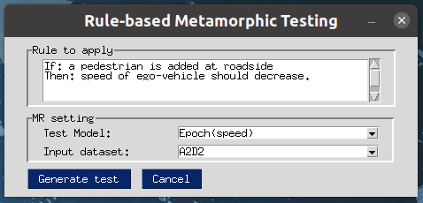
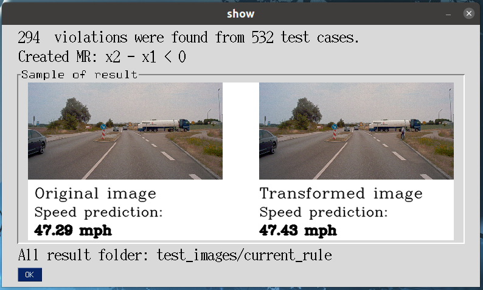

# Rule-based metamorphic testing

## Introduction

This repository is for the paper [A Declarative Metamorphic Testing Framework
for Autonomous Driving]() submitted to TSE.


This figure shows the architecture of RMT. It consists of three components: (1) a **NLP-based semantic parser** that automatically transformed the driving rule described by the domain expert in natural language into the metamorphic relation, (2) a **test case generator** that manipulates the original road image and then generates the new metamorphic image, and (3) a **metamorphic relation validator** that check wehther the model violates the MR. 

RMT currently incorporates three kinds of graphics and image transformation engines: 
1. **Integrating OpenCV** for the *Add* transformation,
2. **Integrating UNIT** for the *Replace* transformation,
3. **Integrating Pix2pixHD** for *Remove* and *Replace* transformations. 

Such pluggable transformation engines can be supplied by domain experts to express and test complex traffic rules, such as simultaneously changing the driving time to night time and injecting a pedestrian in front of a vehicle.

In this paper, we express 7 Metamorphic Rules (MRs): 

- **Rule 1**  
*If*: a pedestrian appears on the roadside,
*Then*: the ego-vehicle should slow down. 

- **Rule 2**  
*If*: a speed limit sign appears on the roadside,  
*Then*: the ego-vehicle should slow down.  

- **Rule 3**  
*If*: a pedestrian appears on the roadside,  
*Then*: the ego-vehicle should slow down at least 30%.  

- **Rule 4**  
*If*: a pedestrian appears on the roadside,  
*Then*: the ego-vehicle should slow down.  
*If*: he gets closer to the ego-vehicle.  
*Then*: the speed should decrease more.   

- **Rule 5**  
*If*: lane lines are removed from the road,   
*Then*: the steering angle of ego-vehicle should keep the same.

- **Rule 6**  
*If*: the buildings are replaced with trees,   
*Then*: the steering angle of ego-vehicle should keep the same.

- **Rule 7**  
*If*: the driving time changes into night,  
*Then*: the ego-vehicle should slow down.   

*For detailed introductions to each rules, please refer to the paper.*


## Prerequisites

+ Python version: 3.6
+ GPU : NVIDIA P100 12G memory (Requiring 12G memory or larger for Pix2pixHD)
+ Pytorch version: 1.1+
+ Python libraries like OpenCV, Spacy, NLTK, PySimpleGUI, PIL, scipy==1.1.0, dominate.

### install spacy model
```
python -m spacy download en_core_web_md
```

### install NLTK wordnet module
```
import nltk
nltk.download('wordnet')
```

## How to use RMT
First, you need to download [pretrained driving models and transformation engine models](https://drive.google.com/file/d/1sCqwcfePOD9KL4Wa-w-0ctdtUBTe8JGH/view?usp=sharing) and the [a2d2 dataset](https://drive.google.com/file/d/1d7TnKrhwh_AEPUGIB3j6o3RPsFtnpzf_/view?usp=sharing). The you could extract folders `driving_models` and `generator_models`  from `models.zip` to the folder `./models`, and extract  folder `a2d2` to  folder `./data`.

To run RMT, you need to make sure that you have set up an environment same with the section **Prerequisites**.

Then you need to get into the the project folder in the terminal and run
```python
python rmt_prototype.py
```

Currently, this GUI has been tested on **Ubuntu 20.04**. 


In this interface, you can copy a rule introduced before to the textbox and select the model for testing.


Then click the button 'Create test'. The program will automatically parse the input rule, call the correct transformation engine, generate test cases, and test the driving models. When the pipeline is finished, a result interface will popup.




## Configurations
RMT uses yaml to configure transformation engines, driving models, and datasets. At the launch of RMT, the UI is automated created by parsing the yaml file `./config/configuration.yaml`. Users could also easily change the configs of default transformation engines or add new transformations by modifying the configuration file. 

## Dataset

In experiments we used *A2D2* dataset, which is published by Audi and contains images extracted from driving videos. The complete dataset could be donwloaded form its [official website](https://www.a2d2.audi/a2d2/en/download.html). Please download the dataset for semantic segmentation. In the project we use images in `20180807_145028` folder as the test set. We also created a training dataset following the same data format as Cityscape dataset used in Pix2pixHD training.


